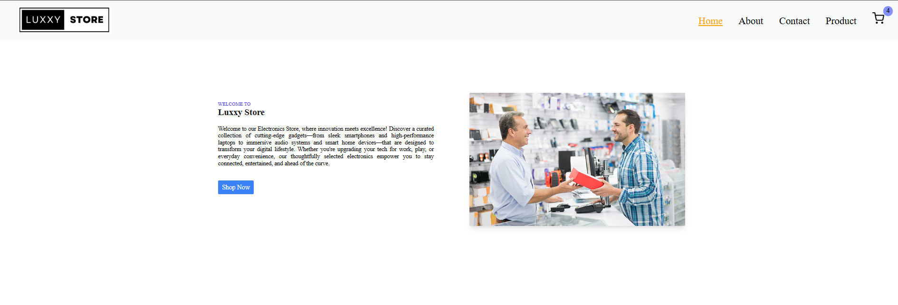
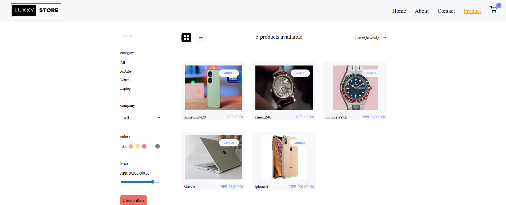
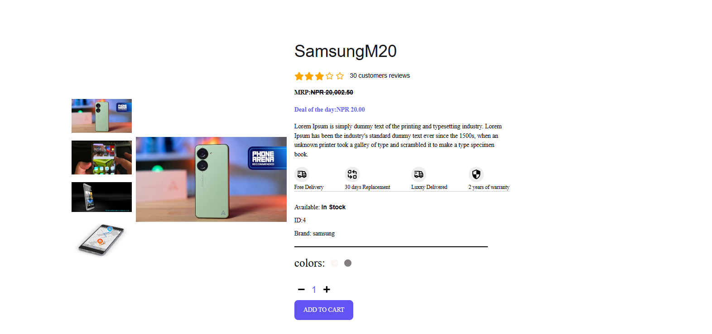
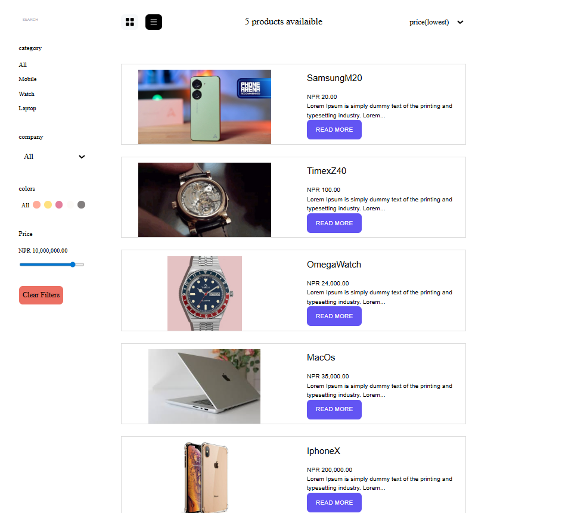
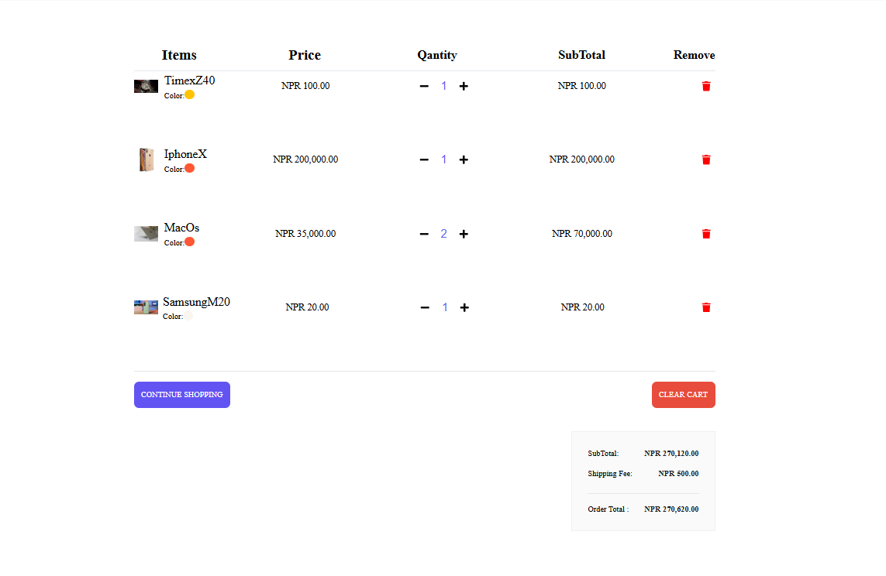
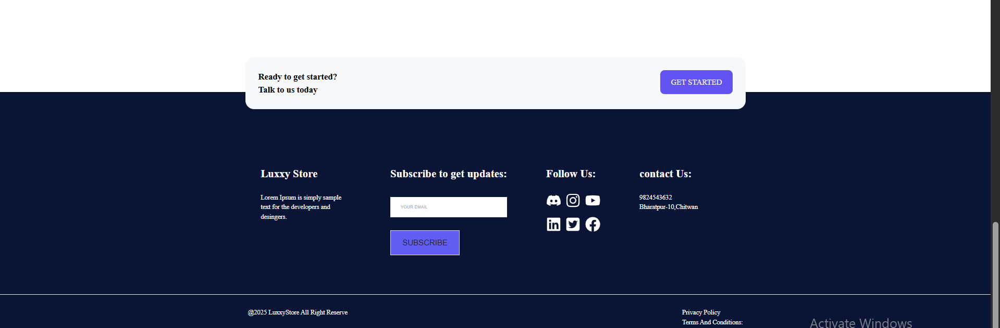
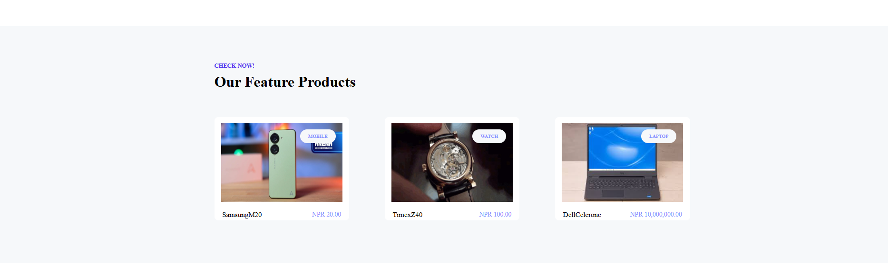
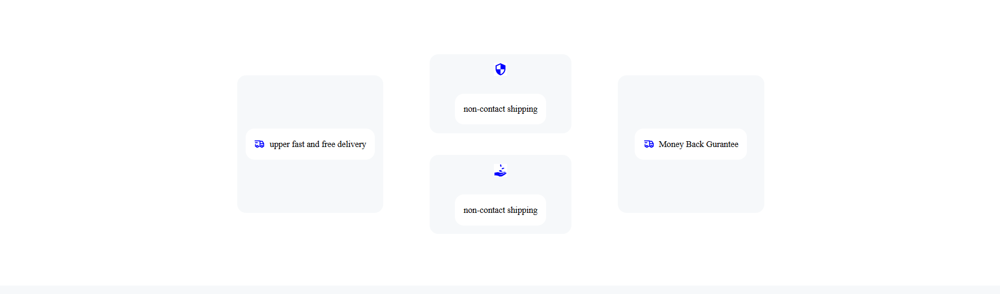
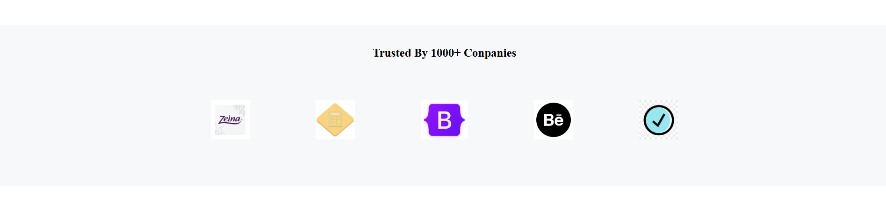

# 🛒 E-commerce Web Application

A simple and responsive shopping platform that allows users to browse products, log in, and manage their cart.

🔗 **Live Demo:** [View Application](https://e-commerce-csn3-git-master-laxmi-regmis-projects.vercel.app/)

---

## 📌 Features

- 🏬 **Product Listings** – View a catalog of products with images and details.  
- 🛍️ **Cart Functionality** – Add, update, or remove products from the cart.  
- 🔑 **User Authentication** – Login system to manage personalized user sessions.  
- 📱 **Responsive UI** – Optimized for desktop, tablet, and mobile screens.  
- ⚡ **Fast Performance** – Built with a modern frontend and backend stack.

---

## 🛠️ Tech Stack

**Frontend**  
- React.js  
- Tailwind CSS  

**Backend**  
- Node.js  
- Express.js  

---

## 🚀 Installation & Setup

Follow these steps to run the project locally:

```bash
# Clone the repository
git clone <repository-url>

# Navigate to the project folder
cd e-commerce-app

# Install dependencies for frontend
cd client
npm install

# Install dependencies for backend
cd ../server
npm install

# Start the backend server
npm start

# Start the frontend
cd ../client
npm start
```

<table> <tr> <td><b>Home Page</b></td> <td><b>Products Page</b></td> </tr> <tr> <td></td> <td></td> </tr> <tr> <td><b>Single Product Page</b></td> <td><b>List View</b></td> </tr> <tr> <td></td> <td></td> </tr> <tr> <td><b>Cart Page</b></td> <td><b>Footer Section</b></td> </tr> <tr> <td></td> <td></td> </tr> <tr> <td><b>Feature Section</b></td> <td><b>Service Section</b></td> </tr> <tr> <td></td> <td></td> </tr> <tr> <td><b>Trusted Section</b></td> </tr> <tr> <td></td> </tr> </table> 
